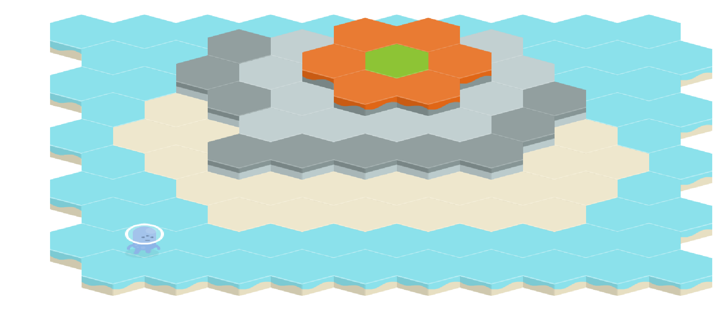

# Kingdom War

Free cross-platform turn-based tactical RPG. In development right now. Written in Java using [Libgdx](https://libgdx.badlogicgames.com/) and [artemis-odb](https://github.com/junkdog/artemis-odb). Tests are written in Groovy/[Spock](https://github.com/spockframework/spock). It runs on Android, Desktop and on the web.

Current state of the game:

## Contributing

### Building

Build for the web: `gradlew.bat html:superDev`

### Tests

`gradle test`

## Useful links

Help for hexagon grids: http://www.redblobgames.com/grids/hexagons/

## License

MIT
